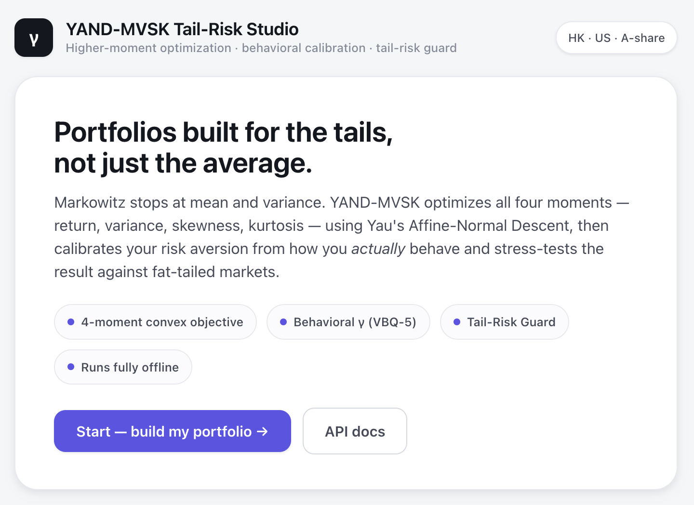
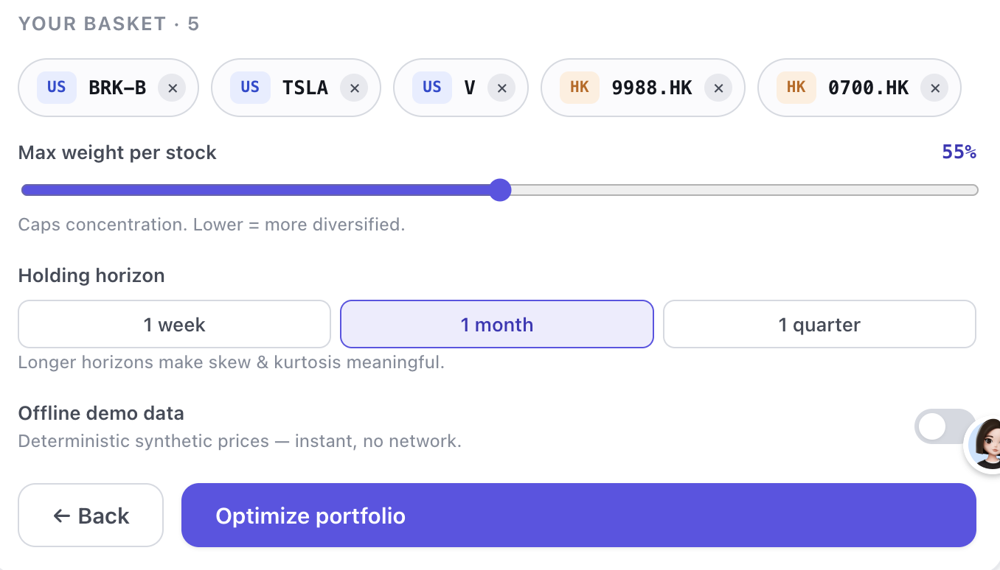
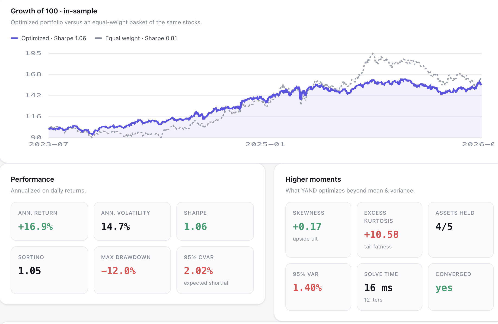

# YAND-MVSK Tail-Risk Studio

**Higher-moment portfolio optimization with behavioral risk calibration and a tail-risk guard — across HK, US, and A-share markets.**

Pick your stocks, answer five questions about how you *actually* behave when markets fall, and get a portfolio optimized across all four statistical moments (return, variance, skewness, kurtosis) — then screened by a tail-risk guard that tells you, in plain language, how fragile it is and what to do about it.

Runs fully **offline, out of the box**: `./run.sh` and open your browser.

---

## 📖 Why four moments?

Markowitz gave us mean–variance optimization. But real financial returns aren't Gaussian — they have **fat tails and asymmetry**. The 2008 crash, the COVID drop, the 2015 A-share crash: these are tail events that a mean–variance optimizer is blind to by construction.

**YAND-MVSK** optimizes across all four moments in one problem — maximize return, minimize variance, **maximize skewness** (prefer upside), **minimize kurtosis** (avoid tail blowups) — using **Yau's Affine-Normal Descent (YAND)**, a level-set-geometry optimizer from the team of Fields Medalist Shing-Tung Yau ([arXiv:2603.28448](https://arxiv.org/abs/2603.28448), [arXiv:2604.25378](https://arxiv.org/abs/2604.25378)).

Two ideas make it more than a research prototype:

1. **Behavioral γ calibration.** A 5-question Visual Behavioral Questionnaire (VBQ-5) sets the risk-aversion parameter γ from your *behavior under stress*, not your stated preference — because the two rarely agree.
2. **The Tail-Risk Guard.** A single 0–100 resilience score, plain-language findings, historical + synthetic stress tests, and a recommendation engine that searches safer reconfigurations and only suggests one when it genuinely helps.

> ⚠️ This is a **research / education tool, not investment advice.** See [Limitations](#️-limitations--caveats).

---

## 🚀 Quick start

**One command** (creates a virtualenv, installs everything, launches the studio):

```bash
./run.sh
```

Then open **http://127.0.0.1:8000** and follow the three steps: *Risk profile → Choose stocks → Results*.

<details>
<summary>Manual setup (if you prefer)</summary>

```bash
python3 -m venv .venv && source .venv/bin/activate
pip install -r requirements.txt
PYTHONPATH=src python -m uvicorn yand_mvsk.api.app:app --port 8000
```
</details>

Everything works with **zero network access** — the app falls back to deterministic synthetic price data (clearly labelled) for any ticker it can't fetch live. Toggle *Offline demo data* in the UI to force it.

---

## 🖥️ The studio

A minimal, single-page web app (vanilla JS, no build step, hand-rolled SVG charts):

| Step | What happens |
|------|--------------|
| **1 · Risk profile** | Answer VBQ-5. A live γ dial updates as you go and maps you to an aggressive / moderate / conservative profile. |
| **2 · Choose stocks** | Search and pick 2–15 tickers across US, Hong Kong and A-share. Set the per-name cap, holding horizon, and offline toggle. |
| **3 · Results** | Optimal weights (donut), Tail-Risk Guard score (gauge + findings), growth-of-100 vs an equal-weight benchmark, full performance & higher-moment stats, and stress tests. |

### Screenshots

<p align="center">
  
</p>
<p align="center">
  
</p>
<p align="center">
  
</p>
---

## 🐍 Python API

```python
from yand_mvsk import EfficientMVSK
from yand_mvsk.data import fetch_prices

data = fetch_prices(["AAPL", "0700.HK", "600519.SS", "TLT", "GLD"], offline=True)

ef = EfficientMVSK.from_prices(data.prices, gamma=6, horizon=21, max_weight=0.35)
ef.optimize()

print(ef.clean_weights())          # {'MSFT': 0.22, 'TLT': 0.19, ...}
ef.portfolio_performance(verbose=True)
```

### With behavioral γ calibration

```python
from yand_mvsk import BehavioralGammaOptimizer

answers = {"Q1": "C", "Q2": "A", "Q3": "C", "Q4": "D", "Q5": "C"}  # loss-averse
bgo = BehavioralGammaOptimizer()
gamma = bgo.calculate_gamma(answers)     # -> 20.0 (Conservative, capped)

ef = EfficientMVSK.from_prices(data.prices, gamma=gamma, horizon=21)
ef.optimize()
```

### The full pipeline (γ → data → optimize → guard) in one call

```python
from yand_mvsk.api.service import optimize_portfolio

out = optimize_portfolio(
    tickers=["NVDA", "0700.HK", "600519.SS", "TLT", "GLD"],
    answers={"Q1": "B", "Q2": "B", "Q3": "A", "Q4": "A", "Q5": "A"},
    offline=True, max_weight=0.35, horizon=21,
)
out["weights"], out["risk"]["score"], out["recommendation"]
```

---

## ⌨️ Command line

```bash
# Optimize a basket straight from the terminal
PYTHONPATH=src python -m yand_mvsk.cli optimize AAPL 0700.HK 600519.SS TLT GLD \
    --answers '{"Q1":"B","Q2":"B","Q3":"A","Q4":"A","Q5":"A"}' --offline

# Or run the studio
PYTHONPATH=src python -m yand_mvsk.cli serve --port 8000
```

(After `pip install -e .`, the `yand-mvsk` command is available directly.)

---

## 🧠 Behavioral calibration (VBQ-5)

Traditional questionnaires ask "how much loss can you tolerate?" — but people mispredict their own behavior under stress, and absolute percentages are meaningless (15% is a crash for a bank, a Tuesday for a tech stock). VBQ-5 uses **relative, scenario-based** prompts to detect three biases and a horizon:

| # | Bias | Detects | γ effect |
|---|------|---------|----------|
| **Q1** | Loss aversion | Buy the dip vs. cut losses | A ×0.8 · B ×1.05 · **C ×1.4** |
| **Q2** | Disposition effect | Selling winners, holding losers | **A +2.0** · B +0 |
| **Q3** | Overconfidence | Width of your forecast interval | A ×0.9 · B ×1.1 · **C ×1.5** |
| **Q4** | Time horizon | Years until you need the money | A ×0.75 · B ×1.0 · C ×1.3 · **D ×1.6** |
| **Q5** | Realized panic | What you *actually* did in a past drawdown | A ×0.8 · B ×1.1 · **C ×1.6** |

```
final_γ = clip( base_γ(=6) × Π(multipliers) + Σ(additions),  1.5,  20 )
```

Biased/fearful answers **raise** γ (more tail-averse); genuinely risk-tolerant answers — buys dips, decade-long horizon, held through a crash — **lower** it. This two-sided calibration is what lets the questionnaire reach all three profile bands (a purely upward adjustment, as in the original design note, can never produce an aggressive profile):

| Profile | γ range | Description |
|---------|---------|-------------|
| **Conservative** | 12 – 20 | Capital preservation; retirees, the loss-sensitive |
| **Moderate** | 5 – 8 | Most retail investors |
| **Aggressive** | 1.5 – 3 | Long horizon, rides out tail events |

---

## 🛡️ The Tail-Risk Guard (the new risk-control feature)

The optimizer picks weights; the Guard answers *how fragile is the result, and should I act?* It runs on the realized daily returns of the chosen weights, so there's nothing to mis-specify.

- **Resilience score (0–100)** — a continuous, monotone blend of bounded penalties for left-skew, excess kurtosis, expected shortfall (CVaR), and drawdown. A strictly less tail-risky portfolio always scores at least as high.
- **Plain-language findings** — e.g. *"Fat tails (excess kurtosis 3.3): outsized moves more likely than a normal distribution implies."*
- **Rolling monitor** — 60-day skewness/kurtosis early-warning, plus the README's kurtosis-spike rebalancing trigger.
- **Stress tests** — replays your exact basket through historical crash windows (COVID-19, 2022 bear, 2018 Q4, 2015 A-share) when the data covers them, and always falls back to a distribution-free simultaneous-tail shock.
- **Recommendation engine** — searches safer reconfigurations (**higher γ** *and* a **tighter concentration cap**) and offers a one-click "apply" **only when it materially lifts the score**. If the tail risk is structural to your assets, it says so and **names the biggest contributor to expected shortfall** instead of pretending γ can fix it.

```python
from yand_mvsk import TailRiskGuard
verdict = TailRiskGuard().evaluate(portfolio_daily_returns,
                                   asset_returns=asset_daily, weights=w)
verdict.score, verdict.level, verdict.findings
```

---

## ⚡ How the optimizer works (and its honest scope)

YAND follows the **equi-affine normal** of the objective's level sets rather than the Euclidean gradient. The directions are invariant under volume-preserving affine maps, so they adapt to anisotropic curvature; on a strictly convex quadratic they coincide with the Newton direction (verified in the test suite against SciPy's mean–variance solution).

**No moment tensors are ever built.** The gradient, Hessian-vector product, third-order action, and the exact quartic line-search polynomial are all computed from products with the `T×n` return matrix and elementwise operations — **O(Tn) storage**, never O(n³) or O(n⁴). The long-only cap is handled by an active set, so weights come out with **exact zeros**, not interior-point dust.

**Scope note (honest):** this ships the paper's *direct* configuration, which the paper reports as preferred below ≈80–100 assets — the sweet spot for hand-picked baskets. Realistic baskets (3–50 names) solve in **single-digit milliseconds**. The large-scale preconditioned-CG configuration that reaches the paper's "800+ assets in ~0.05 s" headline is **not** implemented here; the direct solver still runs at n≈800 but in seconds, not that headline time.

---

## 🏗️ Project structure

```
yang-mvsk-tailrisk/
├── run.sh                          # one-command launcher
├── requirements.txt · pyproject.toml
├── src/yand_mvsk/
│   ├── moments.py                  # tensor-free MVSK oracles + quartic line search
│   ├── linalg.py                   # simplex/affine-normal frames, capped projection
│   ├── yand.py                     # Yau's Affine-Normal Descent + active set
│   ├── optimizer.py                # EfficientMVSK wrapper
│   ├── behavioral.py               # VBQ-5 questionnaire + γ calibration
│   ├── risk.py                     # tail metrics · monitor · stress · Tail-Risk Guard
│   ├── data/                       # HK/US/A-share catalog + fetch (+ offline synthetics)
│   ├── api/                        # FastAPI app + orchestration service
│   └── cli.py                      # `yand-mvsk serve|optimize`
├── frontend/                       # zero-build SPA (index.html · styles.css · app.js)
├── examples/                       # runnable basic_usage.py · behavioral_calibration.py
└── tests/                          # 61 pytest checks (all offline)
```

---

## 🌐 API reference

| Method | Endpoint | Purpose |
|--------|----------|---------|
| `GET`  | `/api/health` | Liveness + version |
| `GET`  | `/api/questionnaire` | VBQ-5 schema + profile bands |
| `POST` | `/api/gamma` | Answers → calibrated γ + explainable breakdown |
| `GET`  | `/api/catalog` · `/api/search?q=` | Ticker catalogue / search |
| `POST` | `/api/optimize` | Full pipeline → weights, performance, guard, stress |

Interactive docs at `/docs` (Swagger UI) when the server is running.

---

## 🧪 Tests

```bash
pip install -r requirements.txt pytest httpx
PYTHONPATH=src pytest        # 61 tests, all offline & deterministic
```

Coverage includes: oracle gradients vs finite differences, Newton-equivalence on quadratics, agreement with SciPy multistart on full MVSK, γ-monotonicity of variance, the full VBQ-5 answer space staying in bounds, guard-score monotonicity, CVaR component decomposition, synthetic-data determinism, and every API route.

---

## ⚠️ Limitations & caveats

- **Higher moments are noisy.** Skewness and especially kurtosis are extremely sensitive to outliers; estimates from limited history can be mostly noise. Use short-enough windows, and treat this as one input, not gospel.
- **Frequency matters.** The app optimizes on multi-period (default 21-day) horizon returns *precisely because* daily higher moments are numerically negligible next to variance — but that trades off estimation stability. Choose the horizon deliberately.
- **In-sample.** Performance figures and the guard score are computed in-sample on the chosen history. They are not forecasts.
- **Not a silver bullet.** A risk-aware complement to, not a replacement for, fundamental judgment.

---

## 📚 References

- Yau's Affine-Normal Descent — [arXiv:2603.28448](https://arxiv.org/abs/2603.28448) (framework & convergence), [arXiv:2604.25378](https://arxiv.org/abs/2604.25378) (large-scale higher-moment portfolios)
- Wang, Zhou, Ying, Palomar (2023). *Efficient and Scalable Parametric High-Order Portfolios via the Skew-t Distribution.* IEEE TSP.
- Boudt, Cornilly, Van Holle, Willems (2020). *MVSK Portfolio Tilting.*

## 📄 License

MIT
